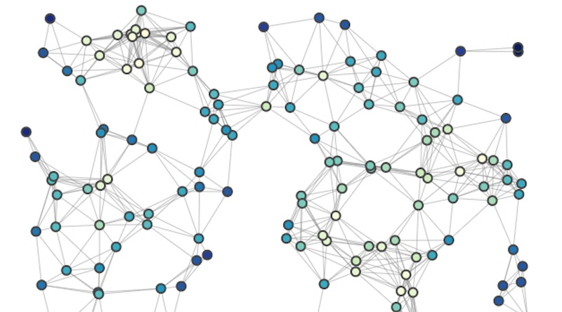

# ALTEGRAD Kaggle Challenge - Predicting the h-index of authors

## Description

The goal of this challenge is to study and apply machine learning/artificial intelligence techniques to
a real-world regression problem. In this regression problem, each sample corresponds to a researcher
(i. e., an author of research papers), and the goal is to build a model that can predict accurately the
h-index of each author. More specifically, the h-index of an author measures his/her productivity and
the citation impact of his/her publications. It is defined as the maximum value of h such that the
given author has published h papers that have each been cited at least h times.

## Get started

### Requirements

At the root of the /code folder, run `pip install -r requirements.txt`.

### Data/Input

All the data preprocessed with the features is on available for download through `gdown`.

### File orgnization

All the code is found under the `code/` directory:

- `baselines/` contains the baseline models for evaluating h-indices
- `notebooks/` is containing all the major notebooks we have used to compute the author embeddings from abstracts with scibert, the Doc2Vec abstracts embeddings, the node embeddings strategies as well as the structural graph features. All the notebooks should be functional but were entirely run on google colab to avoid dependency issues and to gain GPU power.
- `The final submission notebook is at the root of the code folder.
